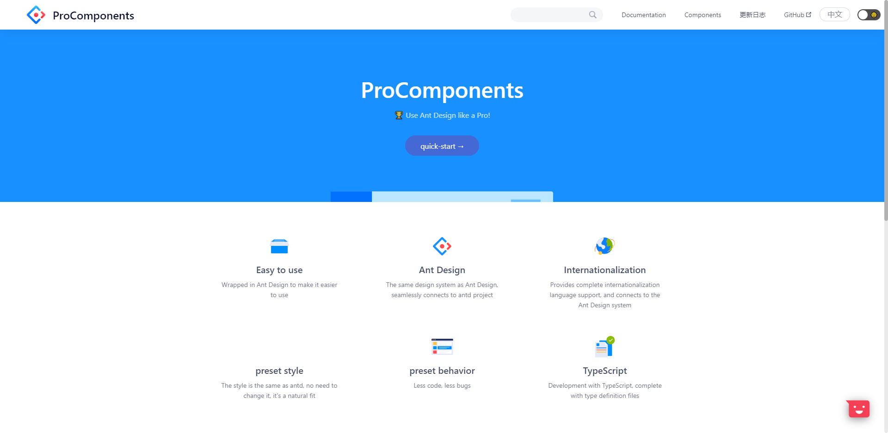
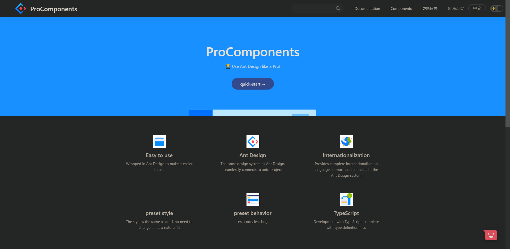

<p align="center">
  
</p>
<h1 align="center">React Darkreader</h1>

<p align="center">🌓 A React Hook for adding a dark / night mode to your site inspired by <a href="https://github.com/darkreader/darkreader" target="_blank">darkreader</a>
</p>

<p align="center">
  <a href="https://www.npmjs.com/package/react-darkreader" target="_blank"></a>  <a href="https://github.com/umijs/dumi" target="_blank"></a>  <a href="https://www.jsdelivr.com/package/npm/react-darkreader" target="_blank"></a>
</p>

<p align="center">Live Demo ✨ <a href="https://react-darkreader.vercel.app" target="_blank">https://react-darkreader.vercel.app</a></p>

## Getting Started

Install with yarn

```bash
yarn add react-darkreader
```

Or you can

```bash
npm install react-darkreader
```

Or inject the script at your page by [jsdelivr CDN](https://www.jsdelivr.com/)

```html
<script src="https://cdn.jsdelivr.net/npm/react-darkreader@latest/dist/index.min.js"></script>
```

## 🚀 Usage

You can import the darkmode as a react component.

```tsx | pure
import React from 'react';
import Darkreader from 'react-darkreader';

export default () => <Darkreader />;
```

You can also create darkmode by the react hook `useDarkreader`

```tsx | pure
import React from 'react';
import { Switch, useDarkreader } from 'react-darkreader';

export default () => {
  const [isDark, { toggle }] = useDarkreader(false);

  return <Switch checked={isDark} onChange={toggle} />;
};
```

## 📔 API

### Component

```tsx | pure
<Darkreader
  defaultDarken
  theme={/** Theme options **/}
  fixes={/** Contains fixes for the generated theme **/}
  onChange={isDark => {
    /** Callback for change **/
  }}
/>
```

### Hook

```typescript | pure
const [isDark, { toggle, collectCSS }] = useDarkreader(defaultDarken, theme?, fixes?)
```

with a toggle button as ui.

```tsx | pure
<Switch checked={isDark} onChange={toggle} />
```

### Result

| Params     | Description                                             | Type                          |
| ---------- | ------------------------------------------------------- | ----------------------------- |
| isDark     | The status of current darkmode, support `true`, `false` | `boolean`                     |
| toggle     | The function for toggling the darkmode.                 | `() => void`                  |
| collectCSS | The async function for collecting the css of darkmode.  | `async () => Promise<string>` |

### Params

| Params        | Description                                                                                                                                                                   | Type              | Default |
| ------------- | ----------------------------------------------------------------------------------------------------------------------------------------------------------------------------- | ----------------- | ------- |
| defaultDarken | The default status of the darkreader                                                                                                                                          | `boolean`         | false   |
| theme         | The options of darkreader Theme [refered to index.d.ts &rarr;](https://github.com/darkreader/darkreader/blob/13c93a995cde0b933580174106897bb1d13f53b4/index.d.ts#L41)         | `Partial<Theme>`  | -       |
| fixes         | Contains fixes for the generated theme [refered to index.d.ts &rarr;](https://github.com/darkreader/darkreader/blob/13c93a995cde0b933580174106897bb1d13f53b4/index.d.ts#L121) | `DynamicThemeFix` | -       |

## 🔢 Coming Soon

- [x] add the material design styling in switch
- [ ] followSystemColorScheme
- [ ] localstorge
- [ ] playground for editing the config online

## 🔨 Contribute

Install dependencies,

```bash
$ npm i
```

Start the dev server,

```bash
$ npm start
```

Build documentation,

```bash
$ npm run docs:build
```

Build library via `father-build`,

```bash
$ npm run build
```

## 🥇 Who is using

| [Ant Design Pro Components Light](https://procomponents.ant.design/) | [Ant Design Pro Components Dark](https://procomponents.ant.design/) |
| :------------------------------------------------------------------: | :-----------------------------------------------------------------: |
|         |          |

## ❤️ Contributors

Thanks goes to these people (emoji key):

<table style="width: auto">
  <tr>
    <td align="center">
      <a href="https://github.com/Turkyden">
        <br />
        <sub><b>Turkyden</b></sub></a><br />
        💻📖🚇⚠️
    </td>
    <td align="center">
      <a href="https://github.com/chenshuai2144">
        <br />
        <sub><b>chenshuai2144</b></sub></a><br />
        💻🚇⚠️
    </td>
    <td align="center">
      <a href="https://github.com/KnowsCount">
        <br />
        <sub><b>KnowsCount</b></sub></a><br />
        📖
    </td>
  </tr>
</table>

## License

[MIT](https://github.com/Turkyden/react-darkreader/blob/main/LICENSE)
